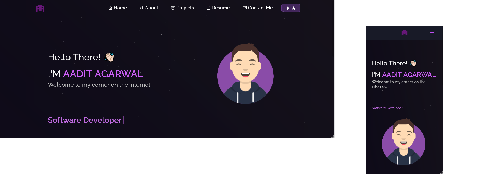

<h2 align="center">
  Portfolio Website 
  <a href="http://aaditagarwal.com/" target="_blank">aaditagarwal.com</a>
</h2>

  

 

 &nbsp;
 &nbsp;
 &nbsp;

## Built With

My personal portfolio <b><a href="http://aaditagarwal.com/" target="_blank">aaditagarwal.com</a></b><i>: My corner on the internet. A website about my technical experience and interests.</i> 

Built using technologies:

- ReactJS
- NodeJS
- CSS3
- VsCode
- Vercel
- EmailJS

## Features

**📖 Multi-Page Layout**

**🎨 Styled with React-Bootstrap and Css with easy to customize colors**

**📱 Fully Responsive**

 

 

Copyright <a href="https://github.com/soumyajit4419/Portfolio">SB</a> 2021
